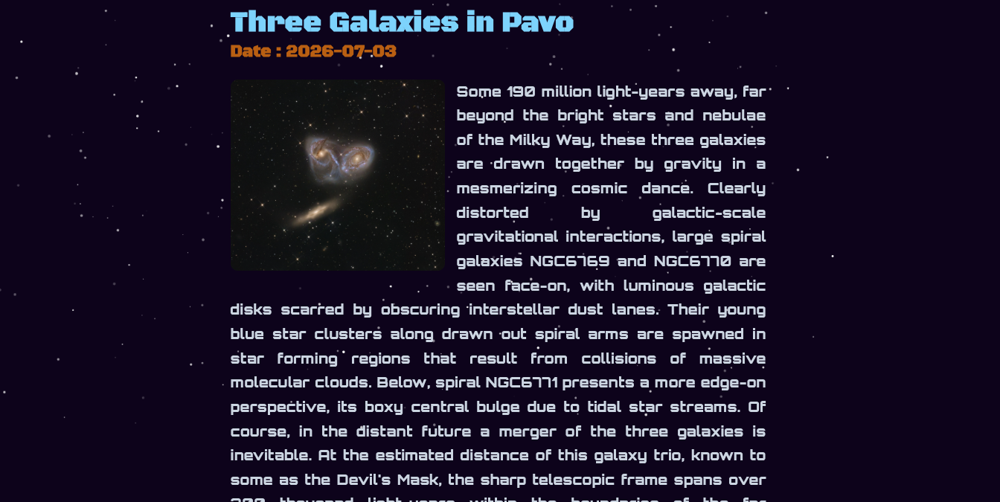

<p align="center">
  
</p>

A simple and minimal NASA's APOD (Astronomy Picture of the Day) website with a star background animation made using JavaScript and HTML's Canvas feature.


### Features
* **Error Handling** - Handles errors thrown by the NASA API key.
* **Request Timeouts** - The API sometimes fails to return data, so it includes a 7-second timeout fallback.
* **Star Background** - A background filled with moving and blinking stars.
* **API Output Based Rendering** - Dynamically renders using the `` tag for images or an `<iframe>` to play videos.
* **Splash Screen** - A splash screen featuring the StarGazer logo!
* **Calendar Feature** - allows users to input any date they want and see NASA's APOD for that day.
* **Secure Environment** - Uses environment variables to prevent credential leaks.


### Stack
* **Frontend:** HTML, CSS, JavaScript
* **Tooling:** Vite
* **Deployment:** GitHub Pages
  
Right Now the main problem is probably the fail rate of the fetching. NASA API Connection fails are sadly often.

### AI Usage
* Used AI To Make Some **Stylistic Elements** like the Logo
* Took Some Help From AI in Making the **Starry Background Animation**

---

### Getting Started

Visit the website at: [l0stxrising.github.io/StarGazer/](https://l0stxrising.github.io/StarGazer/)

**To Host Locally:**

1. Clone the repository:
   ```bash
   git clone [https://github.com/L0stxRising/StarGazer.git](https://github.com/L0stxRising/StarGazer.git)
